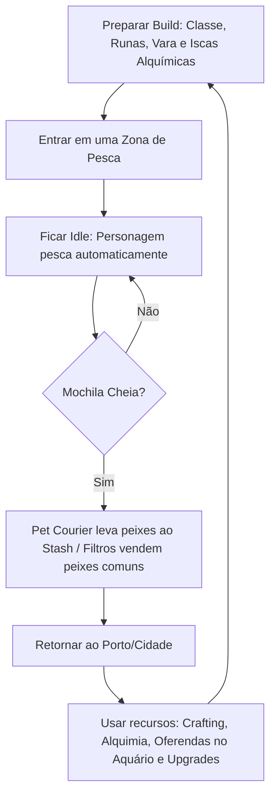

# Game Design Document: Fishing Heroes RPG

Este documento descreve a visão conceitual, o loop de gameplay e as mecânicas de jogo para o **Fishing Heroes RPG**, um jogo de RPG de pesca em estilo *Idle* (passivo/estacionário).

---

## 1. Visão Geral do Jogo

**Fishing Heroes RPG** é um RPG passivo focado na arte da pescaria, progressão de atributos e otimização de equipamentos. O jogador assume uma **Classe de Pescador** e viaja por diferentes mundos (zonas de pesca) para capturar desde pequenos peixes comuns até criaturas marinhas míticas e titânicas. 

O foco principal do jogo é a **estratégia de preparação (Build)**, envolvendo a escolha da Classe, inserção de Runas nos equipamentos, Alquimia de Iscas e a **automação do progresso**. O jogador monta seu conjunto, escolhe onde quer pescar e deixa o personagem agindo de forma passiva, otimizando seus ganhos mesmo enquanto está ausente (offline).

---

## 2. O Loop de Gameplay Principal (Core Loop)

O ritmo do jogo é cíclico e recompensa o planejamento a longo prazo:

1. **Preparação:** O jogador escolhe sua Classe, equipa vara, molinete e linha (modificados com Runas) e fabrica a isca alquímica adequada para o Boss ou peixe raro desejado.
2. **Expedição:** Entra em um mundo prestando atenção ao **Clima Dinâmico** da zona.
3. **Pescaria Passiva:** O jogo simula o combate (cabo de guerra), aplicando Efeitos de Status (sangramento, fúria) de acordo com o equipamento e tipo do peixe.
4. **Gerenciamento de Carga:** Automação via Pet e Filtros de inventário.
5. **Desenvolvimento no Porto:** Converter peixes em Ouro, forjar/sintetizar equipamentos, fabricar iscas por Alquimia e exibir raridades no Aquário Monumental.

---

## 3. Mecânica de Pesca (Cabo de Guerra Simulado e Dinâmico)

A batalha de cabo de guerra é o coração do jogo, afetada por equipamentos, classes e condições globais:

### Atributos do Pescador
* **Força do Personagem:** Poder muscular. Drena a estamina do peixe.
* **Força do Molinete:** Velocidade de recolhimento e redução de tensão.
* **Resistência da Linha:** Tensão limite suportada.
* **Flexibilidade da Vara:** Amortecedor contra puxões violentos.

### Atributos e Status do Peixe
* **Força de Fuga, Peso e Estamina:** Determinam a dificuldade base.
* **Status Effects (Efeitos de Status):** 
  * *Enfurecido:* O peixe dobra sua força de fuga por breves segundos, testando o limite de ruptura da linha.
  * *Exausto:* O peixe para de puxar, permitindo recolhimento rápido.
  * *Sangrando:* Aplicado por Runas do jogador; o peixe perde estamina passivamente ao longo da luta.

### Clima Dinâmico e Eventos Ambientais
As Zonas de Pesca sofrem alterações climáticas globais temporárias. Exemplo:
* **Tempo Limpo:** Condições normais.
* **Tempestade:** Aumenta a agressividade de todos os peixes (maior força de fuga, consumindo mais durabilidade do jogador), mas dobra a chance de pescar criaturas Lendárias e permite o encontro com Chefes de Estágio (Bosses).

---

## 4. O Sistema de Automação de Inventário

* **Filtros de Triagem Inteligente:** Descarte ou venda automática condicional programada pelo jogador (ex: "vender comuns imediatamente").
* **O Pet Transportador (Courier):** Esvazia a mochila periodicamente levando os itens para o Stash no Porto. Pode ser aprimorado via Skill Tree (maior capacidade e menor tempo de viagem).

---

## 5. Sistemas de Progressão, Build e "Min-Maxing"

### 5.1. Classes de Pescador
O jogador não é genérico; ele escolhe ou foca em uma Especialização, alterando seu estilo de jogo:
* **Brutamontes (Bruiser):** Foco em Força de Puxada. Derrota peixes grandes rapidamente, mas desgasta seus equipamentos muito mais rápido.
* **Estrategista/Trapper:** Aumenta a velocidade de atração (peixes mordem em menos tempo) e possui chance de "Pesca Dupla" (trazer dois peixes menores de uma vez). Ideal para farmar materiais.
* **Místico:** Usa mana/energia para encantar a isca. Tem bônus massivo para encontrar peixes de alta raridade e ignora parcialmente as penalidades de clima ruim.

### 5.2. Runas e Modificadores de Equipamento
Equipamentos possuem *Slots*. O jogador pode engastar Runas para afinar a build perfeitamente:
* **Runa de Linha Farpada:** Causa Sangramento no peixe.
* **Rolamento de Titânio:** Aumenta a Força do Molinete, mas reduz a flexibilidade da vara.
* **Amuleto da Maré:** Aumenta a chance de atrair Bosses durante tempestades.

### 5.3. Alquimia de Iscas (Síntese)
Peixes não comerciais e restos (escamas, espinhos, óleos) são usados na Alquimia.
* Para avançar para mapas mais difíceis, o jogador deve enfrentar o **Chefe de Estágio (Act Boss)**.
* Esses Chefes não mordem iscas comuns. O jogador precisa farmar materiais específicos na zona atual, usar a Alquimia para sintetizar uma *Isca de Sangue Refinado* (ou similar) e focar sua build para aguentar o combate extremo desse Chefe.

### 5.4. O Aquário Monumental (Progressão Global Passiva)
Em vez de vender todos os peixes lendários por ouro, o jogador pode fazer uma **Oferenda** deles para o seu Aquário Monumental.
* Cada espécie única exibida no Aquário concede um bônus global e permanente ao jogador em todos os seus loadouts e classes.
* *Exemplo:* Exibir um "Tubarão Branco Perfeito" concede +3% de Força contra predadores globais eternamente. Isso cria um objetivo central de colecionador ("Pegar todos para maximizar os buffs base").

### 5.5. Categorias de Peixes e Skill Tree
* **Categorias de Peixe:** Comerciais (Gold), Crafting (Vara/Linha), Alquímicos (Iscas Especiais) e Troféus (Aquário).
* **Skill Tree (Árvore de Habilidades):** Aprimora atributos, desbloqueia/melhora o Pet, reduz perdas de durabilidade global e multiplica bônus recebidos pelo Aquário.
