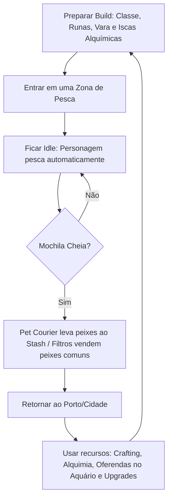

# Game Design Document: Fishing Heroes RPG

Este documento descreve a visão conceitual, o loop de gameplay e as mecânicas de jogo para o **Fishing Heroes RPG**, um jogo de RPG de pesca em estilo *Idle* (passivo/estacionário).

---

## 1. Visão Geral do Jogo

**Fishing Heroes RPG** é um RPG passivo focado na arte da pescaria, progressão de atributos e otimização de equipamentos. O jogador assume uma **Classe de Pescador** e viaja por diferentes mundos (zonas de pesca) para capturar desde pequenos peixes comuns até criaturas marinhas míticas e titânicas. 

O foco principal do jogo é a **estratégia de preparação (Build)**, envolvendo a escolha da Classe, inserção de Runas nos equipamentos, Alquimia de Iscas e a **automação do progresso**. O jogador monta seu conjunto, escolhe onde quer pescar e deixa o personagem agindo de forma passiva, otimizando seus ganhos mesmo enquanto está ausente (offline).

---

## 2. O Loop de Gameplay Principal (Core Loop)

O ritmo do jogo é cíclico e recompensa o planejamento a longo prazo:

1. **Preparação:** O jogador escolhe sua Classe, equipa vara, molinete e linha (modificados com Runas) e fabrica a isca alquímica adequada para o Boss ou peixe raro desejado.
2. **Expedição:** Entra em um mundo prestando atenção ao **Clima Dinâmico** da zona.
3. **Pescaria Passiva:** na pesca comum, o servidor **resolve cada captura de forma determinística** (poder × dificuldade, com a Sorte como modificador). O combate ativo de cabo de guerra com Efeitos de Status fica reservado à **Batalha de Boss** (seção 3).
4. **Gerenciamento de Carga:** Automação via Pet e Filtros de inventário.
5. **Desenvolvimento no Porto:** Converter peixes em Ouro, forjar/sintetizar equipamentos, fabricar iscas por Alquimia e exibir raridades no Aquário Monumental.

---

## 3. Mecânica de Pesca

O jogo tem **dois modos de pesca**:

* **Pesca comum (isca comum):** modelo **determinístico** com a Sorte como modificador. É o loop principal de farm, detalhado na seção 6. Suporta progresso offline.
* **Batalha de Boss (isca alquímica do mundo):** sistema à parte, ainda em definição, com combate mais ativo (cabo de guerra, status effects). Disparado ao entrar na zona com a isca de boss equipada.

Os atributos abaixo afetam ambos os modos:

### Atributos do Pescador
* **Força do Personagem:** Poder muscular. Drena a estamina do peixe.
* **Força do Molinete:** Velocidade de recolhimento e redução de tensão.
* **Resistência da Linha:** Tensão limite suportada.
* **Flexibilidade da Vara:** Amortecedor contra puxões violentos.

### Atributos e Status do Peixe
* **Força de Fuga, Peso e Estamina:** Determinam a dificuldade base.
* **Status Effects (Efeitos de Status):** 
  * *Enfurecido:* O peixe dobra sua força de fuga por breves segundos, testando o limite de ruptura da linha.
  * *Exausto:* O peixe para de puxar, permitindo recolhimento rápido.
  * *Sangrando:* Aplicado por Runas do jogador; o peixe perde estamina passivamente ao longo da luta.

### Clima Dinâmico e Eventos Ambientais
Cada Localização tem um clima que muda ao longo do tempo (determinístico e compartilhado — ver seção 8.3). Exemplo:
* **Tempo Limpo:** Condições normais.
* **Tempestade:** Aumenta a agressividade dos peixes (maior força de fuga, consumindo mais durabilidade do jogador), mas dobra a chance de pescar criaturas Lendárias e permite o encontro com Chefes de Estágio (Bosses).

---

## 4. O Sistema de Automação de Inventário

* **Filtros de Triagem Inteligente:** regras condicionais por **categoria, raridade e valor mínimo** (ex.: "vender comuns", "guardar troféus", "vender abaixo de X ouro").
* **O Pet Transportador (Courier):** esvazia a mochila periodicamente levando os itens ao Stash. Há **vários pets colecionáveis**, cada um com características próprias; o jogador ativa um por vez. As melhorias da Skill Tree (ex.: "+5% de velocidade dos pets") são **globais** e afetam todos os pets — abrindo espaço para cosméticos, variações e progressão logística.

---

## 5. Sistemas de Progressão, Build e "Min-Maxing"

### 5.1. Classes de Pescador
O jogador não é genérico; ele escolhe ou foca em uma Especialização, alterando seu estilo de jogo:
* **Brutamontes (Bruiser):** Foco em Força de Puxada. Derrota peixes grandes rapidamente, mas desgasta seus equipamentos muito mais rápido.
* **Estrategista/Trapper:** Aumenta a velocidade de atração (peixes mordem em menos tempo) e possui chance de "Pesca Dupla" (trazer dois peixes menores de uma vez). Ideal para farmar materiais.
* **Místico:** Bônus passivo massivo de raridade (Sorte) e ignora parcialmente as penalidades de clima ruim. *(A "mana/energia" é sabor temático — não há recurso ativo a gerenciar; os bônus são passivos, mantendo o modelo determinístico.)*

### 5.2. Runas e Modificadores de Equipamento
Equipamentos possuem *Slots*. O jogador pode engastar Runas para afinar a build perfeitamente:
* **Runa de Linha Farpada:** Causa Sangramento no peixe.
* **Rolamento de Titânio:** Aumenta a Força do Molinete, mas reduz a flexibilidade da vara.
* **Amuleto da Maré:** Aumenta a chance de atrair Bosses durante tempestades.

### 5.3. Alquimia de Iscas (Síntese)
Peixes não comerciais e restos (escamas, espinhos, óleos) são usados na Alquimia.
* Para avançar para mapas mais difíceis, o jogador deve enfrentar o **Chefe de Estágio (Act Boss)**.
* Esses Chefes não mordem iscas comuns. O jogador precisa farmar materiais específicos na zona atual, usar a Alquimia para sintetizar uma *Isca de Sangue Refinado* (ou similar) e focar sua build para aguentar o combate extremo desse Chefe.

### 5.4. O Aquário Monumental (Progressão Global Passiva)
Em vez de vender todos os peixes lendários por ouro, o jogador pode fazer uma **Oferenda** deles para o seu Aquário Monumental.
* Cada espécie única exibida no Aquário concede um bônus global e permanente ao jogador em todos os seus loadouts e classes.
* *Exemplo:* Exibir um "Tubarão Branco Perfeito" concede +3% de Força contra predadores globais eternamente. Isso cria um objetivo central de colecionador ("Pegar todos para maximizar os buffs base").

### 5.5. Categorias de Peixes e Skill Tree
* **Categorias de Peixe:** Comerciais (Gold), Crafting (Vara/Linha), Alquímicos (Iscas Especiais) e Troféus (Aquário).
* **Skill Tree (Árvore de Habilidades):** Aprimora atributos, desbloqueia/melhora o Pet, reduz perdas de durabilidade global e multiplica bônus recebidos pelo Aquário.

---

## 6. Especificações Mecânicas (Decisões Travadas)

Esta seção consolida as regras já fechadas para a **pesca com isca comum**. A Batalha de Boss é um sistema à parte, ainda em definição.

### 6.1. Modelo de Resolução e os Dois Estados Passivos
Há **dois estados passivos distintos**:

* **Idle (jogo aberto) — o foco do jogo.** A pesca comum roda a simulação **determinística e seedada** completa: cada evento (mordida, spawn, captura, luta) é resolvido de verdade. Só aqui saem **peixes, troféus, materiais, drops e XP detalhado**. O resultado é função pura de `(build, zona, seed, índice do evento)` — o tempo decide apenas *quantos* eventos ocorrem.
* **Jogo desligado (app fechado) — recompensa de catch-up.** Não simula eventos. Calcula uma **média de Ouro e XP por hora** baseada na **melhor Localização** que o jogador alcançou, reduzida por **X%** (X melhora com upgrades), aplicada às **primeiras 8 horas** entre logout e login. **Não gera peixes, troféus, materiais nem drops** — só ouro e XP.

> Isso incentiva deliberadamente deixar o jogo **aberto em Idle** (o foco): só nesse estado se obtém itens, troféus e drops. O modo desligado é um consolo proporcional e sempre inferior.

### 6.2. Ciclo de um Evento de Pesca
1. **Mordida:** após um intervalo aleatório (seedado) em **[X, 3X]**, onde X é reduzido por classe (Trapper), atributos de build, equipamentos e runas.
2. **Spawn:** o peixe é sorteado na tabela da zona, com a raridade enviesada pela Sorte.
3. **Captura:** determinística — se `Poder de Pesca ≥ Força Exigida`, captura. Caso contrário, a **Sorte** pode resgatar.
4. **Luta:** duração proporcional à estamina do peixe ÷ poder do jogador → builds mais fortes lutam mais rápido e pescam mais por hora.
5. **Recompensas e consumo:** a captura concede ouro/material/troféu (conforme a categoria) e **XP**; consome 1 carga da isca consumível (ou durabilidade da isca durável) e pode, raramente, dropar **equipamento ou runa**.

### 6.3. Sorte (Dois Atributos)
A Sorte é dividida em dois stats independentes, que agem tanto no **resgate de captura** quanto no **enviesamento de spawn**:
* **Luck Chance:** probabilidade de *proc* (gatilho do efeito).
* **Luck Power:** magnitude do efeito (`+Y` de força no resgate; intensidade do upgrade de raridade no spawn).

Isso cria arquétipos distintos: builds "azaradas-mas-poderosas" (Power alto, Chance baixa) procam raramente, mas com efeito forte; builds "sortudas" (Chance alta) procam o tempo todo com efeito menor.

### 6.4. Escape
Se o peixe não é capturado (poder insuficiente e Sorte não procou), o personagem fica **"preso" por 50% do tempo de luta**, mesmo com o peixe já tendo fugido. Esse tempo é **redutível** por equipamentos, build e Skill Tree → "redução de tempo preso" é um atributo de build desejável.

### 6.5. Durabilidade e Reparo
* Cada captura consome durabilidade (o **Brutamontes** consome mais rápido).
* Ao zerar, o equipamento entra em **modo quebrado**: o poder cai drasticamente → mais escapes e lutas mais longas (punição emergente, sem regra extra).
* O jogador pode ativar **auto-reparo**, que conserta automaticamente consumindo ouro e materiais a um **custo elevado** (dreno opcional por conveniência).

### 6.6. Logística de Inventário
* **Peixes comerciais (ouro):** auto-vendidos no instante da captura; nunca ocupam mochila ou stash.
* **Materiais e troféus:** vão para a mochila até o **Pet** transportá-los ao Stash.
* **Mochila cheia:** se o Pet não dá conta, a **pesca trava** até liberar espaço → teto natural de rendimento e razão real para investir no Pet (intervalo menor / capacidade maior via Skill Tree).
* **Stash:** finito; contam para o limite **materiais, troféus e equipamentos**.

### 6.7. Troféus por Tamanho e Aquário
* Cada espécie tem um **tamanho mínimo e máximo** configurado na base. Na captura o servidor **sorteia o peso por uma Distribuição Normal (curva de Gauss)** centrada no tamanho médio — a maioria dos peixes sai perto da média e os espécimes grandes (troféus) são naturalmente raros. A fração desse peso em relação ao **máximo** decide o destino do peixe:
  * **< 80%** → não é troféu: **auto-venda** por ouro (peixes comerciais/`vendor`).
  * **≥ 80%** → vira **troféu** (instância individual), em faixas:
    | Faixa | % do tamanho máximo |
    |---|---|
    | Comum | ≥ 80% |
    | Raro | ≥ 85% |
    | Épico | ≥ 90% |
    | Lendário | ≥ 95% |
    | Perfeito | 100% (o chase supremo) |
* O troféu guarda **peso, faixa (qualidade) e o local de captura** no Stash. Comuns e materiais seguem sendo contagens fungíveis por espécie.
* O Aquário guarda o **melhor troféu por espécie**; o bônus global escala pela faixa de qualidade, criando a caça ao "espécime perfeito".

### 6.8. Sessão e Build
A build é **congelada no início da sessão**. Trocar classe, runas, equipamento ou isca exige **voltar ao porto/menu**, o que encerra a sessão atual e inicia uma nova (com nova seed e novo snapshot). Isso mantém o determinismo e o anti-cheat íntegros.

---

## 7. Economia e Sistemas de Menu (Decisões Travadas)

### 7.1. Moeda
Economia de **moeda única (Ouro)** — sem moeda premium nesta fase.
* **Fontes:** venda automática de peixes comerciais (principal) e venda de excedentes/materiais.
* **Sinks:** auto-reparo, crafting, re-forja (reroll), troca de runas, alquimia e Skill Tree (se aplicável).

> Como não há válvula premium, o balanço de ouro é crítico: os sinks (auto-reparo caro, re-forja) precisam absorver a inflação gerada pela venda contínua de comerciais.

### 7.2. Crafting de Equipamento (Híbrido)
* A receita garante o **tipo e a raridade base**; os **atributos têm rolagem aleatória** (server-seeded — o cliente não pode re-rolar).
* O **chase de endgame** é perseguir o "item perfeito".
* Existe **re-forja dedicada**, que re-rola os stats do item atual consumindo materiais/ouro (principal sink de endgame), além de fabricar do zero.
* Fonte de equipamento: **crafting + drops raros da pesca**.

### 7.3. Runas e Engaste
* Runas vêm de **drops da pesca/bosses e/ou síntese**.
* O engaste é **reversível e seguro**: trocar runas é livre (com possível custo de ouro como sink leve). Sem risco de perda → o jogador experimenta builds à vontade.

### 7.4. Alquimia de Iscas
Consome restos (escamas, espinhos, óleos) para sintetizar iscas. Duas famílias:
* **Iscas consumíveis (cargas):** gastam **1 carga por peixe**; um craft rende um lote grande (ex.: ~500 cargas). Ao zerar, **auto-recarregam do estoque**; sem estoque, a pesca **não trava** — cai para uma **isca básica** (perfil de spawn/velocidade pior). Geram demanda contínua de materiais.
* **Iscas não-consumíveis (duráveis):** uso infinito, mas têm **durabilidade** — ao zerar entram em **modo quebrado** (penalidade nos bônus), com **auto-reparo opcional** caro, igual ao equipamento.
* **Iscas de boss:** consumidas (1 carga) ao iniciar a Batalha de Boss.

### 7.5. Progressão (XP e Skill Tree)
* Pescar concede **XP** (inclusive no progresso offline). Subir de **nível** concede **pontos de Skill Tree**.
* A Skill Tree aprimora atributos, melhora o Pet, reduz desgaste e multiplica bônus do Aquário.
* Estrutura: **árvore com ramos por pilar** (Pesca, Logística/Pet, Sorte, Aquário), com nós e pré-requisitos lineares dentro de cada ramo. Os bônus de Pet são **globais** (afetam todos os pets colecionados).

### 7.6. Oferenda no Aquário
Registrar um troféu recalcula os buffs globais (`CalculateTotalStats`) e guarda o **melhor por espécie** (por faixa de qualidade).

---

## 8. Mundos, Localizações e Clima (Decisões Travadas)

### 8.1. Estrutura
* O conteúdo é organizado em **Mundos**, e cada Mundo contém **X Localizações**.
* Cada **Localização** tem seu próprio **nível**, **tabela de spawn**, **materiais** e **ciclo de clima**.

### 8.2. Progressão (gated por Act Boss)
* A progressão entre Mundos é **linear**: para liberar o próximo Mundo, é preciso **derrotar o Act Boss** do Mundo atual.
* O Act Boss é invocado com a **isca alquímica** correspondente e pode ser **pescado em qualquer Localização** daquele Mundo.

### 8.3. Clima Determinístico por Localização
* O clima é uma **função pura do tempo** por Localização: `clima(localização, t) = hash(seedGlobal, localização, slot)`.
* É **previsível e compartilhado** (todos na Localização veem o mesmo) e **reconstrutível** em qualquer instante — o motor de pesca lê o clima sem armazenar histórico.
* **Tempestade:** aumenta a força de fuga dos peixes, eleva a chance de Lendários e viabiliza o encontro com o Act Boss.

### 8.4. Farm Retroativo
* O jogador **pode voltar** a Localizações/Mundos anteriores.
* **Ouro e XP** de zonas muito abaixo do seu nível são **reduzidos** (anti-trivialização); **materiais e troféus mantêm o valor** — preservando o farm necessário para crafting e alquimia.

### 8.5. Baseline do Modo Desligado
A média de Ouro/XP por hora do **jogo desligado** (seção 6.1) é derivada da **melhor Localização já alcançada** pelo jogador.

---

## 9. Batalha de Boss (Decisões Travadas)

A Batalha de Boss é o momento **ativo** do jogo — o contraste com o farm idle. É um **cabo de guerra em tempo real** onde o jogador realmente joga.

### 9.1. Invocação
* Com a **isca de boss equipada**, o próximo encontro na pesca (em qualquer Localização do Mundo atual) é o **Act Boss** — a sessão de pesca comum é substituída pela batalha.
* A isca de boss é **consumida ao iniciar** a batalha. Perder = isca gasta (farmar/sintetizar outra). Stakes reais.

### 9.2. Mecânica: Gestão de Tensão
* O jogador **segura para recolher** (drena a estamina do boss, mas **sobe a tensão da linha**) e **solta para aliviar** (a tensão cai).
* O boss **enfurece em ciclos** (seedados): durante a fúria, a força do boss dispara e a tensão sobe muito mais rápido ao recolher — é preciso **soltar na hora certa**.
* Fases de **exaustão** do boss abrem janelas seguras para recolher agressivamente.
* As **Runas de sangramento** drenam estamina do boss passivamente durante toda a luta.
* A **build define os parâmetros:** FishingPower/ReelForce (velocidade de drenagem), LineTension (limite de tensão), runas (sangramento), flexibilidade da vara (amortece picos).

### 9.3. Vitória e Derrota
* **Vitória:** zerar a estamina do boss.
* **Derrota:** a **tensão estoura o limite** (LineTension) → a linha arrebenta. A tensão é o recurso central a gerir.

### 9.4. Tiers e Repetição
* A **isca de boss carrega um tier:** sintetizar um tier maior (mais materiais/raros) invoca um boss mais forte com **drops melhores**.
* O Act Boss é **repetível:** após desbloquear o Mundo, o jogador escolhe o tier que quer enfrentar — **farmar drops** num tier acessível ou **desafiar** um tier alto.
* **Primeira vitória** no Mundo → desbloqueia o próximo Mundo (progressão). Re-batalhas dão **drops escalados pelo tier** (equipamentos, runas, materiais e troféu do boss).
